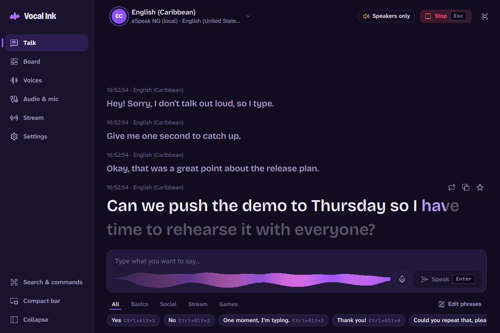
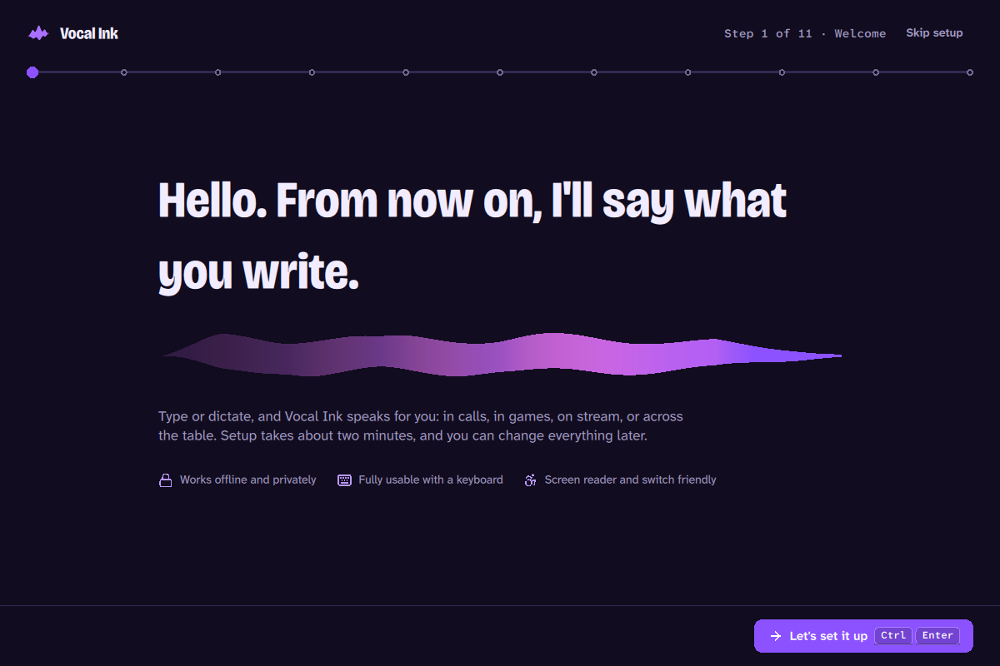
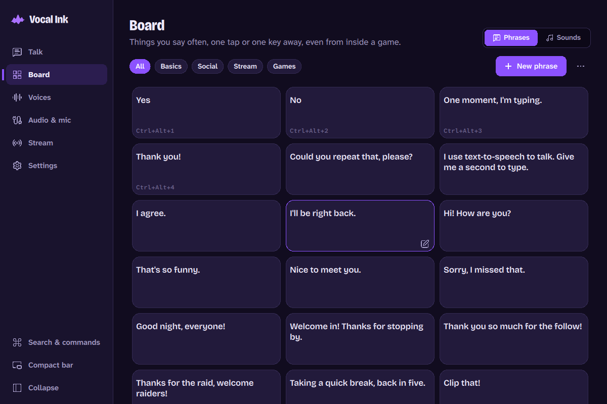
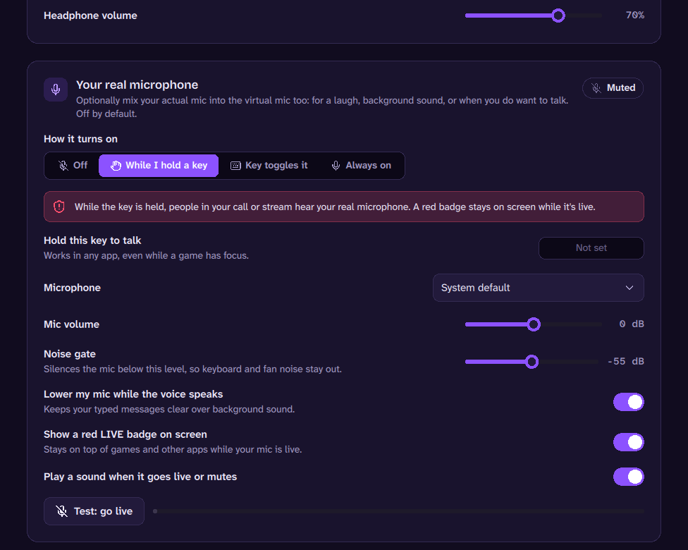

<p align="center"></p>

<h1 align="center">Vocal Ink</h1>

<p align="center"><b>Your words, in a voice you choose — in calls, games and on stream.</b></p>

Vocal Ink is a free desktop app that speaks for people who can't, or don't want to, use their own voice.
**Type** a message, or **speak** (even quietly or unclearly) and let it be written down for you, and Vocal Ink
says it aloud in the voice you pick. Other apps hear it as a **microphone**, so it works in Discord, Zoom,
games and OBS, and it can put **live captions on your stream**.

It is a native C++/Qt 6 app for **Windows, macOS and Linux**. Everything works **offline and for free** with
local voices and on-device speech recognition; cloud voices are optional and use your own API keys.

---

<p align="center"></p>

## Features

<p align="center">
  
  
  
</p>

**Talking**
- Type and press <kbd>Enter</kbd>. The line being spoken **fills with ink word by word**, so you and the people
  around you can follow along, and your voice is drawn as a brush stroke under the message box.
- **Word suggestions** that learn from what you say (on your computer only): <kbd>Tab</kbd> takes the first,
  <kbd>Alt</kbd>+<kbd>1…5</kbd> any of them. <kbd>↑</kbd> brings back earlier messages.
- **Abbreviations** (`brb` → "be right back"), **variables** (`{name}`, `{time}`, `{clipboard}`…), and a choice of
  how emoji and links are read.
- **Board**: phrase tiles in categories with colours, shortcuts and their own voice, and a **soundboard** that
  plays into your virtual mic. **Switch access** scanning steps through phrases for one- and two-switch users.
- **Quick type** over any app or game, a floating **compact bar**, and a full-screen **Show text** view that can
  flip to face the person across the table.
- **Ctrl+K** finds any page, setting, action, phrase or voice.

**Voices** — mix and match, favourite them, switch with a shortcut, save **presets** (voice + speed + pitch + effect),
and add **effects** (radio, telephone, robot, echo, cave, underwater, megaphone):

| Provider | Runs | Cost | Notes |
|---|---|---|---|
| **Piper** | on your computer | free | Natural neural voices in 40+ languages, downloaded in-app. |
| **System voices** | on your computer | free | Windows (SAPI/OneCore) and macOS voices. |
| **eSpeak NG** | on your computer | free | Robotic but tiny; 100+ languages. Used if installed. |
| **Microsoft Azure** | cloud | your key | 500+ neural voices, 140+ languages, speaking styles. |
| **ElevenLabs** | cloud | your key | Very natural voices, and your own cloned voice. |
| **Fish Audio** | cloud | your key | Huge community voice library (searchable in-app) and clones. |
| **OpenAI** | cloud | your key | `gpt-4o-mini-tts` with delivery instructions; any OpenAI-compatible server. |

**Audio routing**
- Vocal Ink ships **its own virtual microphone** ("Vocal Ink Mic") on Windows, macOS and Linux, installed from the
  app; VB-CABLE and BlackHole still work. A built-in **routing check** plays a tone and confirms apps can hear it.
- Hear yourself on your headphones, with separate volumes, and **sound cues** only you hear.
- **Your real microphone, optionally**: mix it in while you hold a key, with a toggle key, or always. It's off by
  default, and whenever it's live a red **MIC LIVE** badge floats over everything and a tone plays. A **panic key**
  stops all sound and mutes the mic.

**Dictation (speak instead of type)**
- On-device with [whisper.cpp](https://github.com/ggml-org/whisper.cpp) — private, free, offline — or any
  OpenAI-compatible service. Push-to-talk (or tap-to-talk), toggle or hands-free; review before speaking, or not.

**Streaming** — see [docs/OBS.md](docs/OBS.md)
- **Caption overlay** for OBS or any streaming app, including an **ink** style that fills words like the app.
- obs-websocket: text-source subtitles, closed captions, and a "talking" source for PNGtuber avatars.
- **Reads Twitch chat aloud** in a voice of your choice, with filters for commands, links, bots and words.

**Shortcuts**: 30+ actions, all rebindable, working while games have focus, with conflict checks and a warning
before binding anything that turns on your real mic.

**Accessibility & comfort**: four themes (Midnight ink, Vellum light, Amethyst true-black, High contrast) or match
the system, nine ink colours, Atkinson Hyperlegible / Lexend / OpenDyslexic fonts, text size up to 250%, letter
and line spacing, bigger buttons, bold focus ring, reduced or no motion, tap-to-talk, ignore repeated presses,
ask before speaking, typing echo, screen-reader announcements, full keyboard control.

**Setup**: a guided first run adapts to where you'll talk (calls, games, stream, in person…) and can be run again
any time. Backups move your whole setup to another computer; the app can tell you when an update is out.

## Getting started

1. **Download** the latest build for your system from the [Releases](https://github.com/Vocal-Ink/Desktop-app/releases) page
   (Windows installer or portable zip, macOS `.dmg`, Linux `.AppImage`).
2. **Set up the virtual microphone** so other apps can hear Vocal Ink. Vocal Ink brings its own
   ([how it works](docs/VIRTUAL_AUDIO.md)): voice output → *Vocal Ink Voice*, and in Discord/OBS/Zoom pick
   *Vocal Ink Mic* as the microphone (macOS: *Vocal Ink Virtual Mic* for both).
   - **Windows:** tick *Install the Vocal Ink virtual microphone* in the installer, or install it from Vocal Ink's
     audio settings. Builds without the signed driver use [VB-CABLE](https://vb-audio.com/Cable/) (free) instead:
     voice output → *CABLE Input*, microphone → *CABLE Output*.
   - **macOS:** install it from Vocal Ink's audio settings (asks for your password). Or use
     [BlackHole 2ch](https://existential.audio/blackhole/) (`brew install blackhole-2ch`).
   - **Linux:** install it from Vocal Ink's audio settings (PulseAudio or PipeWire, no password).
3. **Open Vocal Ink.** The setup walks you through a voice (a free natural one is ~90 MB), the virtual mic,
   dictation (~60 MB model), shortcuts and comfort settings. Every step can be skipped.
4. Type something and press <kbd>Enter</kbd>.

> **macOS:** builds are signed ad hoc. The first time, right-click the app → **Open**. Allow microphone access when asked if you use speech recognition.
> **Linux (Wayland):** system-wide shortcuts need X11/XWayland — start with `QT_QPA_PLATFORM=xcb` to use them.

## Privacy

- Local voices and on-device recognition never send anything anywhere.
- Cloud voices/recognizers receive only the text/audio you choose to process with them, under that provider's terms.
- API keys are stored in your operating system's password manager (Windows Credential Manager, macOS Keychain, Secret Service/KWallet). If none is available they are kept in Vocal Ink's settings file, and the app tells you.
- The caption overlay server listens on `127.0.0.1` only, unless you allow LAN access for two-PC streaming.

## Building from source

Requirements: CMake ≥ 3.25, a C++17 compiler (MSVC 2022, Clang, GCC 11+), **Qt 6.5+** (6.8 LTS recommended) with
*Qt Declarative* (Qt Quick, Controls, Shapes, Dialogs), *Qt Multimedia*, *Qt TextToSpeech* and *Qt WebSockets*,
and Git (dependencies are fetched automatically). Linux also needs `libsecret-1-dev` and `libx11-dev`.

On Ubuntu 24.04 the distribution's Qt 6.4 works too:

```sh
sudo apt install cmake ninja-build g++ libsecret-1-dev libx11-dev qt6-base-dev qt6-declarative-dev \
  qt6-multimedia-dev qt6-speech-dev qt6-websockets-dev qml6-module-qtquick qml6-module-qtquick-controls \
  qml6-module-qtquick-layouts qml6-module-qtquick-shapes qml6-module-qtquick-dialogs qml6-module-qtquick-window \
  qml6-module-qtquick-templates qml6-module-qtqml-workerscript qml6-module-qt-labs-folderlistmodel
```

```sh
cmake -S . -B build -G Ninja -DCMAKE_BUILD_TYPE=Release
cmake --build build
ctest --test-dir build --output-on-failure
./build/src/VocalInk        # macOS: open build/src/VocalInk.app
```

Useful options: `-DVOCALINK_WITH_WHISPER=OFF`, `-DVOCALINK_WITH_HOTKEYS=OFF`, `-DVOCALINK_WITH_KEYCHAIN=OFF`,
`-DVOCALINK_BUILD_TESTS=OFF`. Qt 6.4 also builds, but system voices need Qt 6.6+.
`-DVOCALINK_WITH_MAC_DRIVER=ON` also builds the macOS virtual mic (a Core Audio plug-in) into the app; the Windows
driver builds with MSBuild from `driver/windows`. See [docs/VIRTUAL_AUDIO.md](docs/VIRTUAL_AUDIO.md).

Packaging scripts (used by CI, see `.github/workflows/build.yml`):

| Platform | Command | Output |
|---|---|---|
| Windows | `pwsh packaging/windows/deploy.ps1 -BuildDir build -Version 0.1.0` | Inno Setup installer + portable zip |
| macOS | `packaging/macos/build-dmg.sh build 0.1.0` | drag-to-install `.dmg` |
| Linux | `packaging/linux/build-appimage.sh build 0.1.0` | `.AppImage` |

Command-line options: `--minimized` (start in the tray), `--no-onboarding`,
`--show talk|board|voices|audio|stream|settings[:section]|onboarding[:step]|quicktype|compact|showtext`,
`--demo` (sample conversation) and `--screenshot <file>` (used by CI smoke tests). A `portable.txt` next to the executable keeps all data in a `data`
folder beside it.

### Project layout

```
src/app        AppContext: owns and wires all services
src/core       settings, secrets, phrases, history, text processing, speech queue, shortcuts,
               word prediction, presets, backups, update checks
src/audio      mixer, multi-device output, microphone, VAD, soundboard, effects, real-mic passthrough, cues
src/tts        voice engines (Piper, system, eSpeak, Azure, ElevenLabs, Fish Audio, OpenAI)
src/stt        speech recognition (whisper.cpp, OpenAI-compatible) and the microphone controller
src/models     downloads of Whisper models, the Piper runtime and Piper voices
src/obs        obs-websocket client, OBS integration, caption overlay web server, Twitch chat
src/platform   global hotkeys, virtual audio helpers, the virtual mic installer (VirtualDriver)
src/ui         the bridge between the app and QML (App singleton, list models, the ink stroke item)
src/qml        the Qt Quick interface: design tokens (Theme.qml), components, pages, onboarding, windows
resources/     icons, fonts, word lists and the overlay web page
tests/         Qt Test suites (run with ctest)
packaging/     Windows, macOS and Linux packaging
driver/        the virtual mic drivers: Windows (VocalInkAudio.sys, MS-PL) and macOS (HAL plug-in)
```

## Contributing

Bug reports and pull requests are welcome — especially from people who use AAC or text-to-speech every day.
Please run `ctest` before sending a change.

## License

[Apache License 2.0](LICENSE), except the Windows driver in `driver/windows`, which is derived from a Microsoft
sample and stays under the [Microsoft Public License](driver/windows/LICENSE). Third-party components are listed in
[THIRD_PARTY_NOTICES.md](THIRD_PARTY_NOTICES.md).
