# Using Vocal Ink with OBS Studio

Vocal Ink can put what you say on your stream, so viewers can read along while
the voice speaks. There are four ways to do it. Use one, or combine them:

| Feature | What viewers see | Needs the OBS connection? |
| --- | --- | --- |
| [Overlays](#1-overlays-browser-sources) | Animated captions, Twitch chat being read aloud, or a talking PNGtuber, drawn by Browser Sources | No (only for the one-click setup) |
| [Text-source subtitles](#2-subtitles-in-a-text-source) | Your words in an ordinary OBS Text source that you style yourself | Yes |
| [Closed captions](#3-closed-captions-for-twitch-and-youtube) | Native CC that viewers switch on in the Twitch/YouTube player | Yes |
| [Speaking indicator](#4-show-a-source-while-you-talk) | A source of your own (e.g. a "talking" image) shown only while the voice speaks | Yes |

Most streamers start with a **caption overlay**: it looks good out of the box
and needs no OBS setup beyond adding one source.

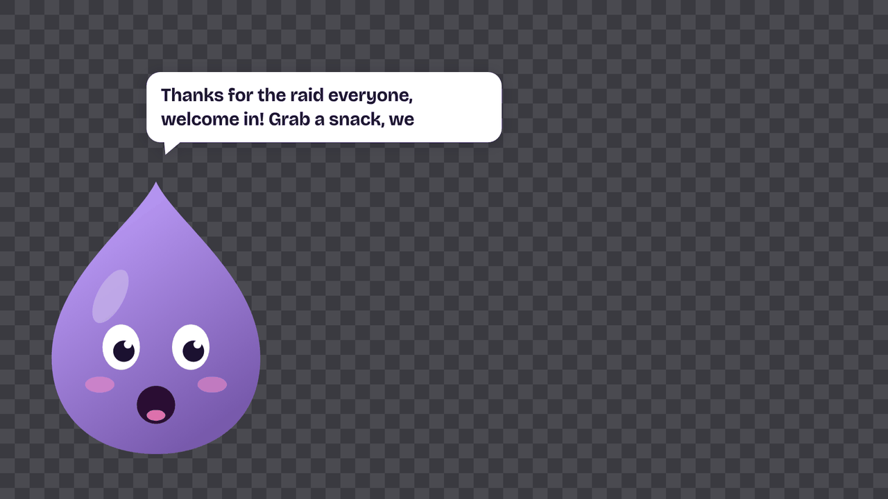

---

## Connecting Vocal Ink to OBS

The subtitle, closed-caption and indicator features, and the one-click overlay
setup, talk to OBS through its built-in WebSocket server. OBS Studio 28 and
newer include it. On older versions, update OBS.

### Turn on OBS's WebSocket server

1. In OBS, open **Tools → WebSocket Server Settings**.
2. Tick **Enable WebSocket server**.
3. Leave **Server Port** at `4455` unless another program already uses it.
4. Keep **Enable Authentication** ticked and click **Show Connect Info** to see
   (and copy) the **Server Password**.
5. Click **Apply**.

### Connect from Vocal Ink

1. In Vocal Ink, open the **Stream** page, tab **OBS**, and turn on the switch next to **OBS**.
2. Host: `127.0.0.1` if OBS runs on this computer. If OBS runs on another
   PC, enter that PC's IP address (see [Troubleshooting](#troubleshooting)).
3. Port: `4455`, or whatever you set in OBS.
4. Password: paste the server password. Vocal Ink keeps it in your system's
   keychain, not in a plain settings file.

The status line should read **Connected to OBS 31.0.2** (with your OBS
version). If OBS isn't running yet, that's fine: Vocal Ink keeps retrying in the
background and connects once OBS starts.

---

## 1. Overlays (Browser Sources)

Vocal Ink runs a small web server on your computer (port `7342` by default).
Each overlay is a web page that OBS shows with a **Browser Source**. The pages
are transparent and show nothing while there is nothing to show.

### Kinds of overlay

Every overlay is a *profile* with its own look. You can have as many as you
like, each in its own Browser Source:

| Kind | Shows |
| --- | --- |
| **Captions** | What you say, word by word, in time with the voice (it follows the real playback, so words appear as they are heard). |
| **Chat** | The Twitch messages Vocal Ink reads aloud (only the ones that pass your chat filters), with names, name colours and badges. The message being read fills with ink as it is spoken. Messages a moderator deletes, and messages of users who are timed out or banned, disappear. |
| **PNGtuber** | A talking avatar: your own images (mouth closed / open, blinking, mic live) or a built-in ink blob, moving with the voice. |

The first captions overlay is called *Captions* and lives at
`http://127.0.0.1:7342/`; the others have their own address,
`http://127.0.0.1:7342/?profile=<name>`.

### Add an overlay

1. Open the **Stream** page, tab **Overlays**, and click **Add overlay**
   (Captions, Chat read aloud or PNGtuber), or pick the existing *Captions*
   overlay. Choose a look under **Look**.
2. Put it in OBS, either way:
   - **Add to OBS scene** (needs the [OBS connection](#connecting-vocal-ink-to-obs)):
     Vocal Ink adds a 1920×1080 Browser Source to the scene that's live. Click
     it again later and it updates that source instead of adding a second one.
   - **Copy** the address, then in OBS click **+** under *Sources*, choose
     **Browser**, paste the address, set **Width** `1920` and **Height** `1080`
     (your canvas size), leave **Local file** unticked and click **OK**.
     Stretch the source to fill the canvas.
3. Change the look in Vocal Ink whenever you like: font, colours, box,
   position, animations, timing, and more. Every change shows up on the
   stream right away; you never need to touch OBS or refresh the source.

To see where things will appear while you arrange the scene, open the
overlay's address with `&demo=1` (or `?demo=1`) added, for example
`http://127.0.0.1:7342/?profile=chat&demo=1`, in your browser or in the
Browser Source. It then loops sample captions, chat messages or avatar
movement in the overlay's look. Remove it when you're done.

The page follows prefers-reduced-motion when a browser asks for it (movement
becomes fades).

### Looks

A look (preset) is a starting point: pick one, then change anything. Every
field is described in [overlay-style.md](overlay-style.md).

| | |
| --- | --- |
| 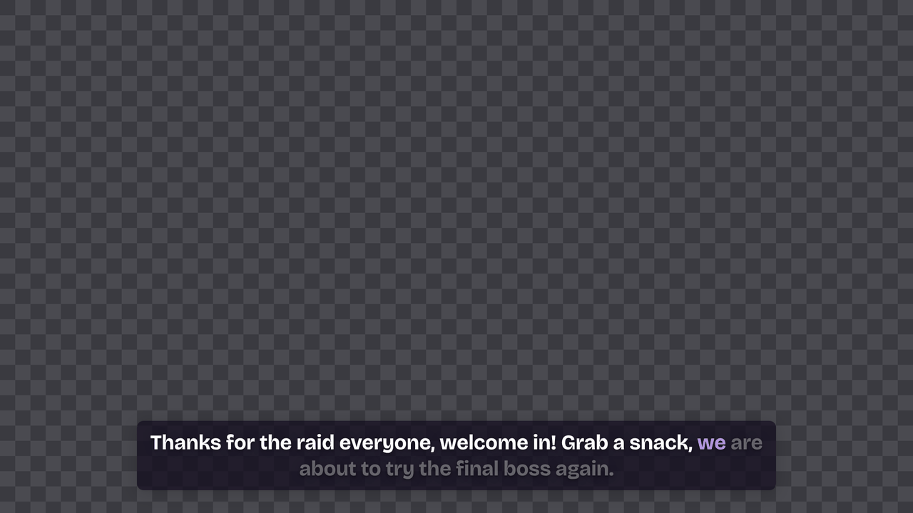 **Subtitles** (default): white text on a dark translucent box, bottom centre. The words still to come are faint; the newest one is violet. | 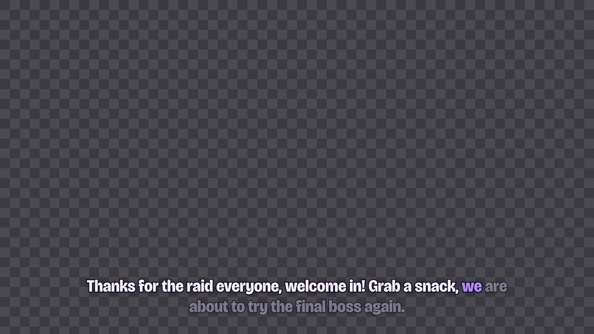 **Ink**: no box, big display type. Each word fills with ink as it is spoken, then dries. |
| 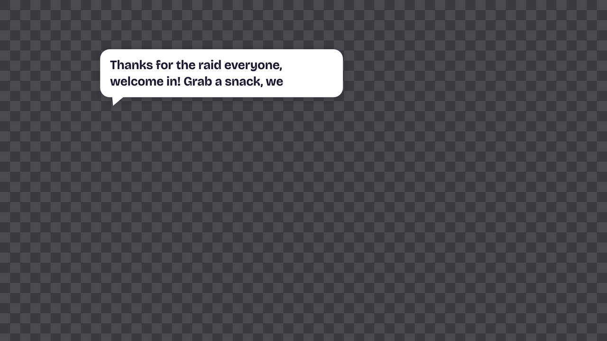 **Bubble**: a white speech bubble with a tail, top left, above a PNGtuber. | 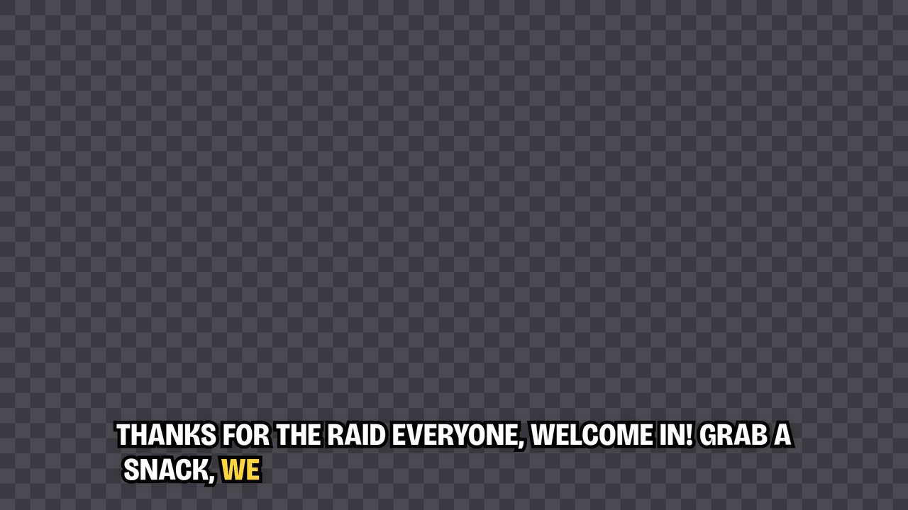 **Outline**: big uppercase text with a thick outline, no box, for games. Words pop in. |
| 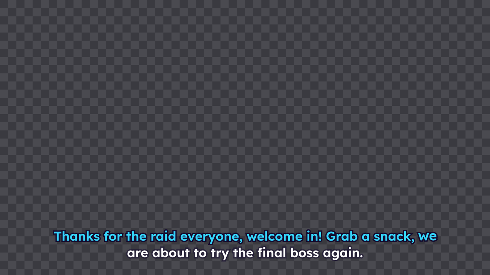 **Karaoke**: all words at once; a sweep lights each one up as it is spoken. | 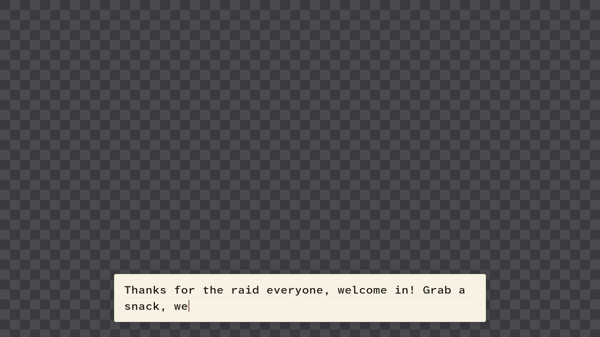 **Typewriter**: a paper card; letters appear one by one behind a caret. |
| 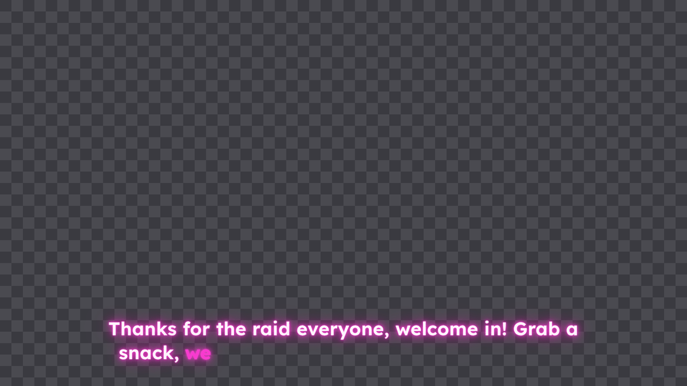 **Neon**: glowing letters in the ink colour. | 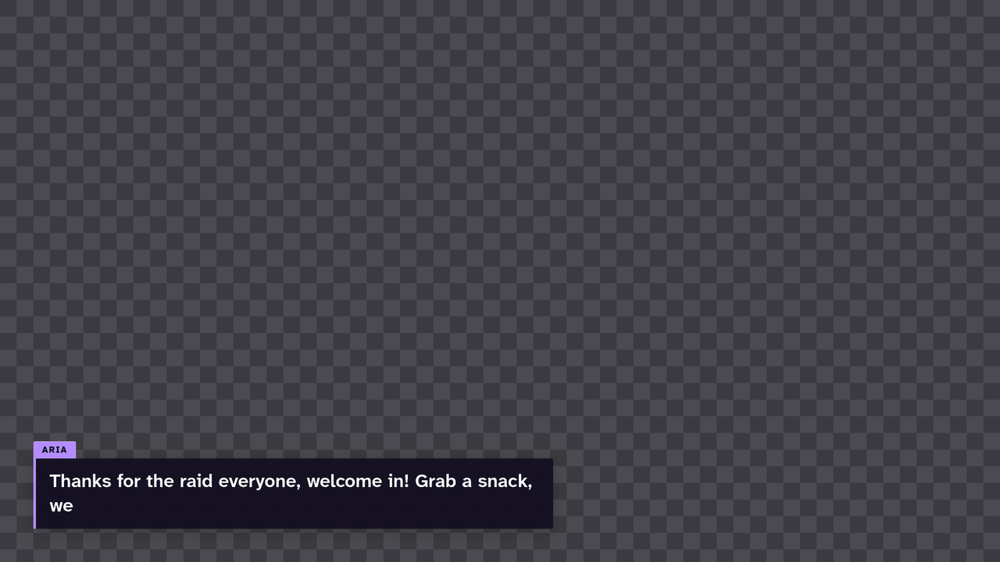 **Lower third**: a name tab and a box with an ink edge, sliding in at the bottom left. |
| 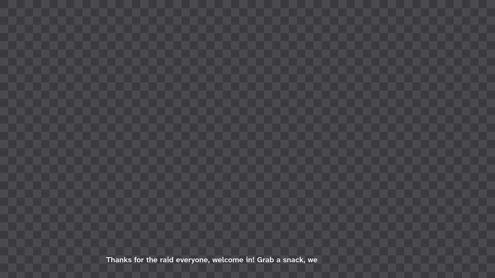 **Minimal**: small plain text with a light shadow. | 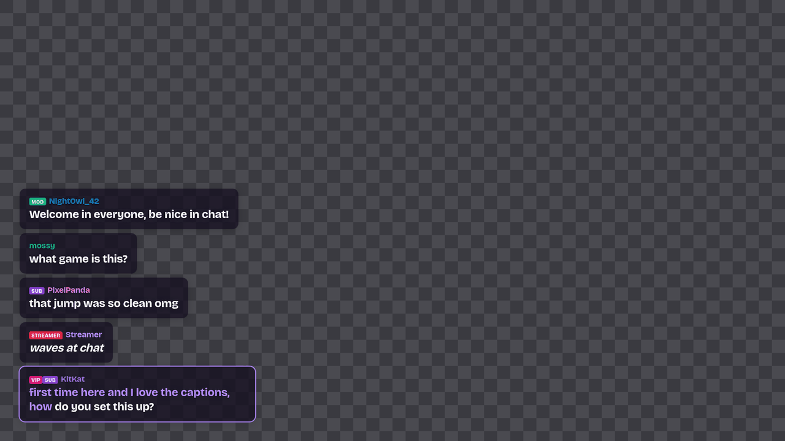 **Chat** overlay: the message being read fills with ink; badges and name colours from Twitch. |

The built-in PNGtuber (no images needed):

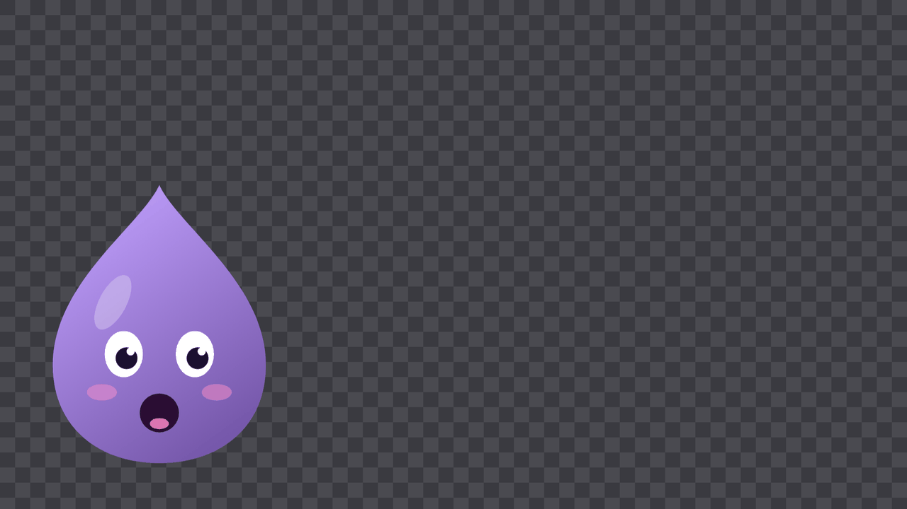

A few things worth knowing:

- **Captions**: *History* keeps earlier captions on screen (with *Roll* they
  move up and fade); *Lines* limits how many text lines one caption uses
  before it scrolls. *Hold* is how long a caption stays after the voice
  finishes (or until the next one). *Reveal* follows the audio by default;
  *Estimate* uses a words-per-second pace instead, *Instant* shows the whole
  caption at once. The name of the voice and a speaking / listening / mic-live
  indicator (dot, bars, or a wave that follows the voice) can be shown too.
- **Chat**: set how many messages stay, whether they fade after a while,
  whether badges and Twitch name colours are shown (too-dark or too-light
  colours are adjusted so they stay readable) and which way the list grows.
- **PNGtuber**: import your images on the **Avatar** page (**Built-in
  PNGtuber**): PNG, GIF, WebP or JPEG, up to 10 MB and 4096 px. Idle and
  talking are enough; blinking and a mic-live picture are optional. Set the
  mouth threshold, the motion (bounce, squash, shake, float), its intensity,
  size, position, a shadow, a glowing ring while your real mic is live, and
  dimming while you're quiet.
- **Custom CSS** is there for the last detail. It can't load anything from
  the internet: the page only talks to Vocal Ink.

### URL options (power users)

Old overlay links keep working. These options in the address override the
overlay's look, field by field: `style` (a look: `subtitles`, `ink`, `bubble`,
`outline`, … or the old `plain`), `position` (`bottom`, `top`, `middle`),
`align` (`left`, `center`, `right`), `tail`, `font`, `size`, `color`, `bg`,
`ink`, `outline`, `outlinecolor`, `reveal` (`word`, `instant`), `wps`, `hold`
(seconds, `-1` = until the next caption), `lines`, `width` (% of the source
width), `roll`, `name`, `indicator`, `motion` (`0` = fades only). Example:
`http://127.0.0.1:7342/?style=bubble&align=left&size=50`.

**Colours:** `#` has a special meaning in URLs, so write hex colours without it
(`color=ffe066`) or as `%23ffe066`. `bg` also takes transparency
(`bg=000000aa`, `bg=rgba(0,0,0,0.6)`, `bg=none`).

The address Vocal Ink used to hand out (for example
`http://127.0.0.1:7342/?style=subtitles`) is recognised: sources with exactly
those options follow the overlay you edit in the app, so you don't have to
change old OBS sources. Your old settings became the *Captions* overlay the
first time you started this version. The full mapping is in
[overlay-style.md](overlay-style.md#url-options).

---

## 2. Subtitles in a Text source

Vocal Ink types what you say into an OBS **Text (GDI+)** (Windows) or
**Text (FreeType 2)** (macOS/Linux) source. You style that source in OBS with
its font, colour, outline and background.

1. On the **Stream** page, turn on **Write subtitles into a text source**.
2. Pick an existing text source from the list, or click **Create one**
   to add one (48 pt Arial) to the scene that's currently live.
3. Set how long the text stays after you finish speaking. **Never** keeps the
   last sentence on screen.
4. Click **Test**. "Vocal Ink test subtitle" should appear in OBS and
   disappear after the delay.

---

## 3. Closed captions for Twitch and YouTube

Vocal Ink can send what you say as real closed captions (CEA-608) inside your
stream. Viewers turn them on with the **CC** button in the player.

1. On the **Stream** page, turn on **Send closed captions with the stream**.
2. Go live from OBS as usual.

Good to know:

- Captions are only sent **while you're streaming**. They aren't part of local
  recordings.
- **Twitch** shows embedded captions through the player's CC button.
- **YouTube** needs *Closed captions → Embedded 608/708* selected in the
  stream settings in YouTube Studio.
- CEA-608 is an old broadcast standard. Plain Latin letters work best, and
  emoji and some accented characters may be dropped.

---

## 4. Show a source while you talk

Vocal Ink can show an OBS source while the voice speaks and hide it again when
it stops, for example a "talking" image of your own avatar:

1. Add two image sources to your scene: *Avatar idle* (always visible) and
   *Avatar talking* above it (for example, with the mouth open).
2. On the **Stream** page, turn on **Show a source while I'm talking** and
   choose *Avatar talking*.
3. Hide *Avatar talking* in OBS (click the eye). Vocal Ink shows it only while
   speaking.

The source must be directly in the scene that's live, not inside a group or
a nested scene. Any source type works, such as an image, a GIF or a media
source.

The [PNGtuber overlay](#kinds-of-overlay) does all this without OBS setup and
moves with the voice. For a small on-screen hint, turn on the indicator of a
captions overlay instead.

---

## Troubleshooting

**"OBS is not running or the WebSocket server is off (Tools → WebSocket Server Settings)"**
Start OBS, and check that **Enable WebSocket server** is ticked and that the
port matches. Vocal Ink retries on its own, so you don't need to restart it.

**"Wrong OBS WebSocket password"**
Copy the password again from **Tools → WebSocket Server Settings → Show Connect
Info**. Passwords are case-sensitive. If you clicked *Generate Password* in OBS,
the old one no longer works. Vocal Ink stops retrying after a wrong password,
so save the new one (or press *Reconnect*) to try again.

**"OBS did not answer…"**
You're probably on OBS 27 or older with the old obs-websocket 4.x plugin.
Update to OBS 28 or newer.

**OBS runs on a second (streaming) PC**
- For the connection, enter the streaming PC's IP address as the host, and
  allow port 4455 through its firewall.
- For the overlays, turn on **Let other computers on my network load them**
  on the **Stream** page (tab **Overlays**). In the Browser Source on the streaming PC, replace
  `127.0.0.1` in the address with the IP address of the PC running Vocal Ink,
  e.g. `http://192.168.1.20:7342/?profile=chat`, and allow port 7342 through
  that PC's firewall. The one-click button always uses `127.0.0.1`, so edit
  the address afterwards.
- Use the IP address, or this PC's own name (`gaming-pc`, `gaming-pc.local`).
  Other names are refused on purpose, so a website can't point its own
  domain at your PC and read your captions (DNS rebinding). If you need
  another name (a hosts-file entry, a router DNS name), add it to the allowed
  host names in the settings (`overlay/allowedHosts`).

**The overlay shows nothing**
- Make sure Vocal Ink is running and the overlays are turned on.
- Open the overlay's address in a normal web browser and add `&demo=1` (or
  `?demo=1`). If you see sample content, the page works.
  `http://127.0.0.1:7342/health` should say `ok`, and
  `http://127.0.0.1:7342/state` shows what the overlays currently get.
- In the Browser Source properties, check the address and size, then click
  **Refresh cache of current page**.
- The pages reconnect by themselves after Vocal Ink restarts, and reload
  themselves after an update. You don't need to touch OBS.

**The overlay shows the wrong look**
- `?profile=` in the address picks the overlay; without it you get
  *Captions*. An address with a profile that no longer exists also shows
  *Captions*.
- Options in the address (like `size=60`) override the look. Remove them to
  follow the app.

**"The OBS caption overlay could not start on port 7342"**
Another program uses that port. Pick a different overlay port in the settings
and update the Browser Source addresses (or click **Add to OBS scene** again).

**Captions look blurry or too small**
Give the Browser Source the same width and height as your canvas (usually
1920×1080) and don't scale it. Change the text size in the overlay's look
instead.

**Fonts look different in OBS**
The bundled fonts (Bricolage Grotesque, Vocal Ink Display, Atkinson
Hyperlegible Next and Mono, Lexend, OpenDyslexic) come from Vocal Ink
itself. Any other font must be installed on the computer that runs OBS.

**The text source or indicator doesn't change**
The status line on the **Stream** page says what went wrong. Usually a source
was renamed in OBS, or the indicator source isn't in the scene that's live.
Pick the source again from the list.

**Closed captions don't show up**
They only appear while you're live, and viewers must turn on CC. On YouTube,
check the *Embedded 608/708* setting. Some platforms and outputs (for example
WHIP) don't carry embedded captions.

### Privacy

The overlay server only accepts connections from this computer unless you turn
on LAN access, and it refuses pages from other websites and host names it
doesn't know. The overlay pages can't load anything from the internet, and
anything they send back is ignored. Chat overlays only show the messages
Vocal Ink reads aloud, never the raw chat. The OBS password itself is never
sent over the network: Vocal Ink answers OBS's login challenge with a hash of
it.
